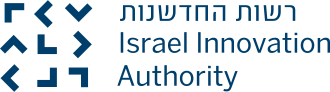

# HebSafeHarbor - CLALIT Validation  
#### ***(version 2)***  
  
  
A de-identification toolkit for clinical text in Hebrew.  
An improved version of Microsoft's HebSafeHarbor project.


HebSafeHarbor was developed according to the requirements described in the file *about_hebsafeharbor* (read more [here](docs/about_hebsafeharbor.docx))

The toolkit integrates and uses open source libraries and assets, including [HebSpacy](https://github.com/8400TheHealthNetwork/HebSpacy) (that runs NER model based on [AlephBERT](https://arxiv.org/pdf/2104.04052.pdf), [Nemo](https://github.com/OnlpLab/NEMO-Corpus) and [BMC](https://www.cs.bgu.ac.il/~elhadad/nlpproj/naama/)), [Presidio](https://microsoft.github.io/presidio/), Wikipedia and public lexicons.  

###### For the **PDF Text Extractor**, to extract text from pathology reports, [click here](https://github.com/ChenMordehai/PDF_Text_Extractor)

## Contents
 - [Establishing the work environment](#establishing-the-work-environment) 
 - [Getting started](#getting-started) 
 - [Versions](#versions)


## Establishing the work environment

Make sure you have [Anaconda](https://www.anaconda.com/download) installed on your computer.

1. Unpack the [`packedhebsafeharbor.zip`](https://drive.google.com/file/d/1MgS-4eo4_HP_wup58ud3JdA82sZ0bFCv/view?usp=sharing) environment file to where you want the environment to go(usually at - **C:\Users\\..\Anaconda3\envs**).
2. Open the standard Command Prompt (cmd.exe) on Windows.
3. Run:

    ``` sh
   cd packedhebsafeharbor
   .\Scripts\activate.bat
   ```

4. The prompt should tell you that you're in the right environment after the last step, so you should see something like the following:
    ``` sh
   (packedhebsafeharbor) C:\Some\Path\Where\Your\Environment\Is>
   ```


## Getting started

#### Use default anonymization
in this case, you don't need to initialize HebSafeHarbor object with parameters.  
Days in medical dates will change to  <יום_>  
```python
from hebsafeharbor import HebSafeHarbor

# use default anonymization
hsh = HebSafeHarbor()

text = """שרון לוי התאשפזה ב02.02.2012 """
doc = {"text": text}

output = hsh([doc])

print(output[0].anonymized_text.text)

#  > <שם_> התאשפזה ב<יום_>.02.2012
```  

#### Use anonymization by context
in this case, initialize HebSafeHarbor object with context.  
Current sypported contexts: ['imaging', 'general', 'family']  
This will make sure that the anonymization will adapt itself to the world of content.
```python
from hebsafeharbor import HebSafeHarbor

# use context anonymization
hsh = HebSafeHarbor(context='imaging')

text = """  .CT רופא מפנה:  דוק טור, (123456)  בדיקה:   ט.מ צוואר  """
doc = {"text": text}

output = hsh([doc])

print(output[0].anonymized_text.text)

# .CT רופא מפנה:  <שם_>, (<מזהה_>)  בדיקה:   ט.מ צוואר  
```

#### Using a custom date shifting/anonymization
in this case, initialize HebSafeHarbor object with a shifting date function and it's additional parameters.
The function signature should be:
```python
def f(params:any, date_string: string) -> Tuple[string, string, string]:
```  
for example:

```python
from hebsafeharbor import HebSafeHarbor
from datetime import datetime, timedelta
from dateutil import parser

def shift_day(params,date_):
    date_obj = parser.parse(date_)
    new_date = date_obj + timedelta(days=params[0])
    return str(new_date.day), str(new_date.month), str(new_date.year)
    

# use default anonymization
hsh = HebSafeHarbor(shift_date_function=(shift_day, [17]))

text = """שרון לוי התאשפזה ב02.02.2012 """
doc = {"text": text}

output = hsh([doc])

print(output[0].anonymized_text.text)

# <שם_> התאשפזה ב19.02.2012
```
## Versions  
current - [About version 2](docs/AboutVersion2.md)  

previous versions:  
[About version 1](docs/AboutVersion1.md)

## Special Thanks
NLP capabilities are based on resources developedg by [ONLP Lab](https://nlp.biu.ac.il/~rtsarfaty/onlp) ([the lab git](https://github.com/OnlpLab)).
Especialy [AlephBERT](https://github.com/OnlpLab/AlephBERT) and [NEMO](https://github.com/OnlpLab/NEMO).  
HebSafeHarbor is an open-source project developed by [8400 The Health Network](https://www.8400thn.org/).  

<br />  

-----

<br />
   

