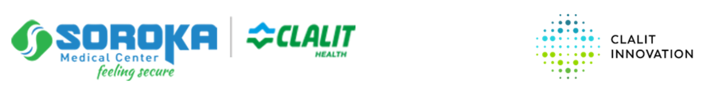

# HebSafeHarbor - CLALIT Validation  
#### ***(version 1)***  
  
  
A de-identification toolkit for clinical text in Hebrew.  
An improved version of Microsoft's HebSafeHarbor project.


HebSafeHarbor was developed according to the requirements described in the file *about_hebsafeharbor* (read more [here](docs/about_hebsafeharbor.docx))

The toolkit integrates and uses open source libraries and assets, including [HebSpacy](https://github.com/8400TheHealthNetwork/HebSpacy) (that runs NER model based on [AlephBERT](https://arxiv.org/pdf/2104.04052.pdf), [Nemo](https://github.com/OnlpLab/NEMO-Corpus) and [BMC](https://www.cs.bgu.ac.il/~elhadad/nlpproj/naama/)), [Presidio](https://microsoft.github.io/presidio/), Wikipedia and public lexicons.


## Contents
 - [Establishing the work environment](#establishing-the-work-environment) 
 - [Getting started](#getting-started) 
 - [Versions](#versions)


## Establishing the work environment

Make sure you have [Anaconda](https://www.anaconda.com/download) installed on your computer.

1. Unpack the [`packedhebsafeharbor.zip`](https://drive.google.com/file/d/1MgS-4eo4_HP_wup58ud3JdA82sZ0bFCv/view?usp=sharing) environment file to where you want the environment to go(usually at - **C:\Users\..\Anaconda3\envs**).
2. Open the standard Command Prompt (cmd.exe) on Windows.
3. Run:

    ``` sh
   cd packedhebsafeharbor
   .\Scripts\activate.bat
   ```

4. The prompt should tell you that you're in the right environment after the last step, so you should see something like the following:
    ``` sh
   (packedhebsafeharbor) C:\Some\Path\Where\Your\Environment\Is>
   ```


## Getting started

```python
from hebsafeharbor import HebSafeHarbor

hsh = HebSafeHarbor()

text = """שרון לוי התאשפזה ב02.02.2012 וגרה בארלוזרוב 16 רמת גן"""
doc = {"text": text}

output = hsh([doc])

print(output[0].anonymized_text.text)

# > <שם_> התאשפזה ב<יום_>.02.2012 וגרה <מיקום_> 16 רמת גן
```

## Versions  
[About version 1](docs/AboutVersion1.md)

## Special Thanks
NLP capabilities are based on resources developedg by [ONLP Lab](https://nlp.biu.ac.il/~rtsarfaty/onlp) ([the lab git](https://github.com/OnlpLab)).
Especialy [AlephBERT](https://github.com/OnlpLab/AlephBERT) and [NEMO](https://github.com/OnlpLab/NEMO).

-----
<br />
<br />
<br />
   


