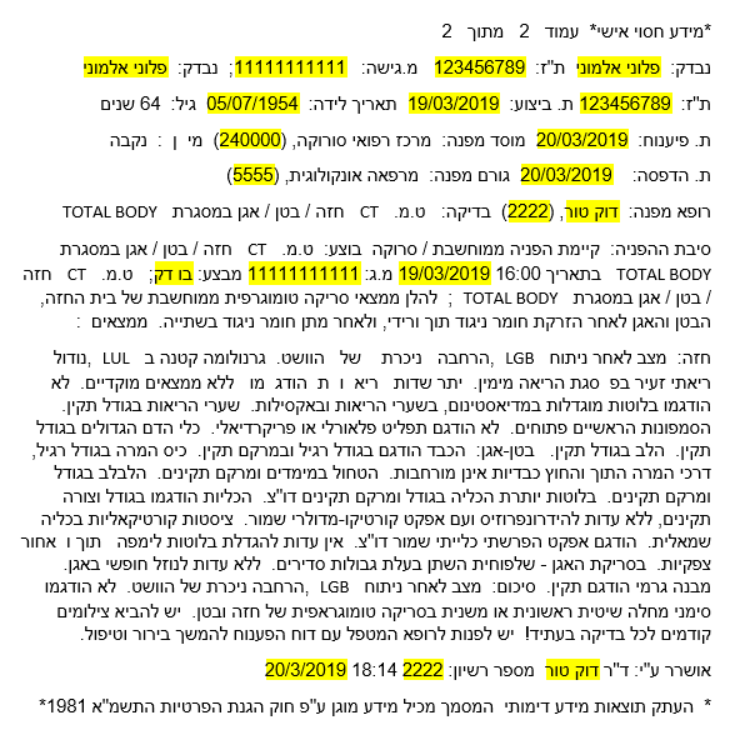
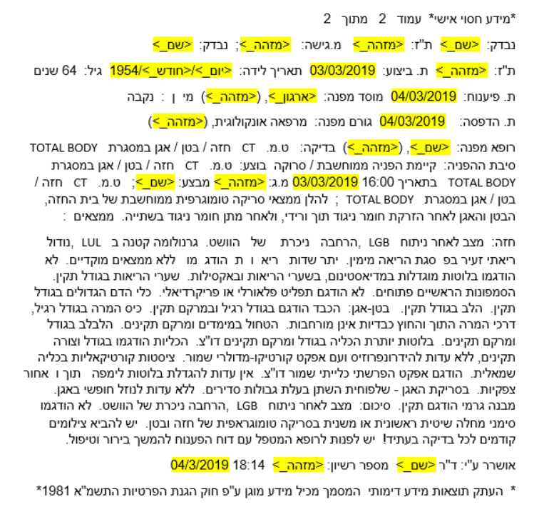

#### HebSafeHarbor - CLALIT Validation  
# Version 1

## Contents
 - [Disadvantages of the previous version](#disadvantages-of-the-previous-version) 
 - [Changes](#changes) 
 - [Improvements](#improvements)
 - [Examples](#examples)
 - [Accuracy metrics](#accuracy-metrics)
 
 ## Disadvantages of the previous version  
 - Over anonymization of medical concepts and clinical descriptions.  
 - Incomplete anonymization of Ethiopian names.  
 - Incomplete anonymization of dates and times in certain formats.  
 - Permanent anonymization rules without reference to the world of medical content.
 
 ## Changes  
 - Expansion of lexicons.
 - Shifting dates according to the study/request number.
 - Handling cases of Incomplete anonymization in English terms (mainly names).
 - Anonymization by domain.

## Improvements  
- False Positive Rate(FPR) dropped from 45.1% to 23.3%, a 21.8% improvement, mainly thanks to the expansion of medical lexicons.  
- True Positive Rate(TPR) rose from 54.9% to 76.7%, an increase of 21.8%. This can be attributed to the decrease of the FPR percentage and anonymizing names in English.  
- There was no significant improvement in average FN cases per file. There are still on average about 2 cases of non-anonymized terms in the text.
 
 ## Examples  
Original text:  
  
  
  
Anonymized text:  
    
  
 
 ## Accuracy metrics
 The performance measurement is based on a batch of 500 chest CT tests, including 780 free texts.  
 
|Version| Average FPR | Average TPR | Average FN cases per file |
| :---: | :---: | :---: | :---: |
|Original| 0.451 | 0.549 | 2.335 |
|Version 1| 0.233 | 0.767 | 2.314 |  
  
An example of a true positive(TP):   

| Original Text | Anonymization |
| :---: | :---: |
|&#x202b; נבדק: ישראל ישראלי ת"ז: 123456789|&#x202b; נבדק: **<שם_>** ת"ז: **<מזהה_>**|  

An example of a false positive(FP):  
 
| Original Text | Anonymization |
| :---: | :---: |
|&#x202b; לא הודגם תפליט פלאורלי או פריקרדיאלי.|&#x202b; לא הודגם **<ארגון_>** פלאורלי או פריקרדיאלי.|  

An example of a false negative(FN):  

| Original Text | Anonymization |
| :---: | :---: |
|&#x202b; נבדק: ישראל בן ישראלי ת"ז: 123456789|&#x202b; נבדק: **ישראל בן ישראלי** ת"ז: **<מזהה_>**|  

 
 
 
   

