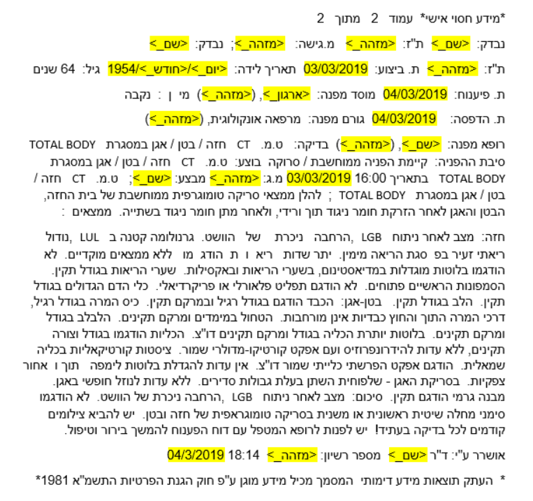

#### HebSafeHarbor - CLALIT Validation  
# Version 3

## Contents
 - [Disadvantages of the previous version](#disadvantages-of-the-previous-version) 
 - [Changes](#changes) 
 - [Improvements](#improvements)
 - [Examples](#examples)
 - [Accuracy metrics](#accuracy-metrics)
 
 ## Disadvantages of the Original version  
 - Over anonymization of medical concepts and clinical descriptions.  
 - Incomplete anonymization of dates and times in certain formats.  
 - Permanent anonymization rules without reference to the world of medical content.
 
 ## Changes  
 - Expansion of lexicons.
 - Shifting/anonymizing dates according to user's need, With the option to use a custom function.
 - Anonymization by domain(context).
 - Handling cases of Incomplete anonymization in English terms (mainly names).

 ## Examples  
Original text:  
  
  
  
Anonymized text:  
    
  
 
 ## Accuracy metrics

### C.T
  
  
 
 

### Pathology
  
  
 
 

  
An example of a true positive(TP):   

| Original Text | Anonymization |
| :---: | :---: |
|&#x202b; נבדק: ישראל ישראלי ת"ז: 123456789|&#x202b; נבדק: **<שם_>** ת"ז: **<מזהה_>**|  

An example of a false positive(FP):  
 
| Original Text | Anonymization |
| :---: | :---: |
|&#x202b; לא הודגם תפליט פלאורלי או פריקרדיאלי.|&#x202b; לא הודגם **<ארגון_>** פלאורלי או פריקרדיאלי.|  

An example of a false negative(FN):  

| Original Text | Anonymization |
| :---: | :---: |
|&#x202b; נבדק: ישראל בן ישראלי ת"ז: 123456789|&#x202b; נבדק: **ישראל בן ישראלי** ת"ז: **<מזהה_>**|  

 
 
 
   

